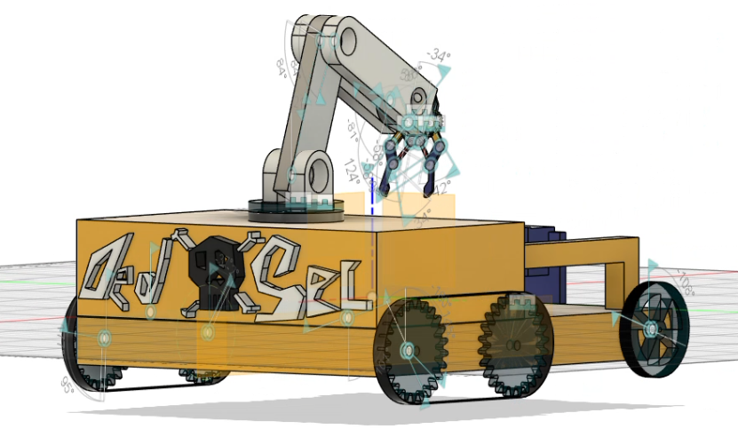

  

# 🤖 Rover CAD Model

This repository contains the CAD design of a **mobile rover integrated with a robotic arm and claw**, developed for robotics applications that require mobility and object manipulation. The design focuses on creating a modular and functional platform that can be adapted for research, educational projects, rapid prototyping, and robotics competitions.

The rover combines a robust mobile base with a multi-joint robotic arm, allowing it to navigate its environment while performing tasks such as picking, placing, and handling objects. The attached claw is designed to provide a reliable gripping mechanism for interacting with a variety of items.

The CAD model emphasizes a balance between structural strength, ease of assembly, and future expandability. Its modular architecture enables individual components to be modified or upgraded without redesigning the entire system, making it suitable for continuous development and customization.

This repository serves as the design foundation for the rover, providing an accurate digital representation that can be used for visualization, manufacturing, simulation, and further mechanical improvements.

Whether you're exploring robotics, developing autonomous systems, or building a competition-ready platform, this project provides a solid starting point for creating a versatile mobile manipulation robot.
